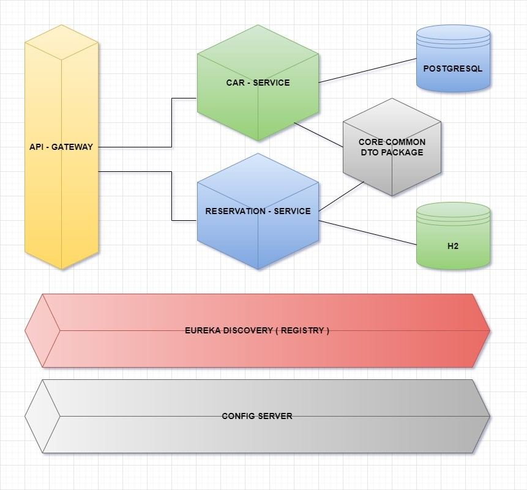

# Rent a Car Microservices Project

### Technology which used
* PostgreSQL / H2 Database
* Spring Boot 3
* Spring Cloud
* API Gateway
* Spring Cloud Config Server
* Spring Boot Actuator
* Eureka Discovery Server / Client

<h3 align="center">Project Structure</h3>

